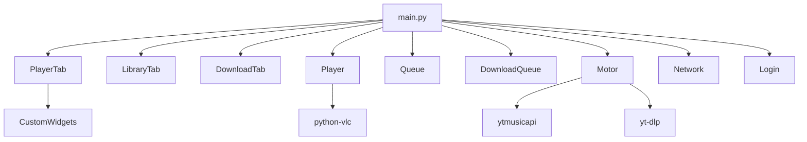

# ReproBabb

[](https://www.python.org/downloads/)
[](https://pypi.org/project/PySide6/)
[](LICENSE)

A minimalist **YouTube Music desktop player** built with Python and Qt6.
Audio plays through VLC, downloads go through yt-dlp, and YouTube Music data comes from ytmusicapi.

> **Unofficial client.** Not affiliated with YouTube or Google.

<!--
Add a real screenshot or a short GIF here, then uncomment:

-->

---

## Features

- **Streaming**: search and play any song from YouTube Music.
- **Library**: browse your playlists and liked songs (requires login).
- **Queue**: shuffle, repeat, "Play Next", click a song to jump to it, and drag to reorder.
- **Radio**: start a queue of similar songs from any track.
- **Downloads**: download a single song or a whole playlist as MP3, with a download queue that shows per-item progress and lets you cancel.
- **Visualizer**: audio bars colored from the album art.
- **Keyboard shortcuts**: see the table below.

---

## Installation

### Requirements

- Python 3.10+
- [VLC](https://www.videolan.org/vlc/) installed. Its bitness must match your Python's (64-bit VLC with 64-bit Python).
- [ffmpeg](https://ffmpeg.org/download.html) in your PATH (needed by yt-dlp to convert downloads to MP3).

### Setup

```bash
git clone https://github.com/Adambabb/ReproBabb.git
cd ReproBabb

python -m venv .venv
source .venv/bin/activate      # Windows: .venv\Scripts\activate

pip install -r requirements.txt
python main.py
```

---

## Usage

1. Search for a song in the top bar and click a result. The queue builds automatically.
2. Right-click a song for **Play Next**, **Add to playlist** or **Download**.
3. Open the **Downloads** tab to follow progress or cancel a download.

### Logging in (for your Library)

1. Open the **Library** tab and click **Create Browser**.
2. Sign in to Google in the window that opens.
3. When it reaches `music.youtube.com`, the window closes by itself and your playlists load.

The session is stored as `browser.json` in your user's application-data folder, outside the project. It contains your account's session data, so **never share it or commit it**. The app uses ytmusicapi's browser authentication, not OAuth.

### Keyboard shortcuts

| Key | Action |
|-----|--------|
| `Space` | Play / Pause |
| `←` / `→` | Previous / Next |
| `↑` / `↓` | Volume up / down |

---

## Architecture



| Module | Responsibility |
|--------|----------------|
| `Main.py` | Entry point. Creates the window and tabs and wires everything together. |
| `Motor.py` | Data layer: search, playlists, similar songs, stream URLs and downloads. **No Qt imports.** |
| `Player.py` | VLC wrapper and playback state. |
| `Queue.py` | Queue data only (shuffle, history, reordering). No widgets. |
| `DownloadQueue.py` | State of the download queue (progress, status, cancellation). |
| `PlayerTab.py` / `LibraryTab.py` / `DownloadTab.py` | The three tabs of the UI. |
| `Network.py` | Thumbnail fetching in background threads. |
| `CustomWidgets.py` | Stateless widgets: visualizer, volume slider, list rows. |
| `Login.py` | Browser window used to create the session. |
| `Utils.py` | `resource_path()`: locates bundled files (styles, icons) both from source and from a packaged build. |
| `Styles/Styles.qss` | Application stylesheet. |

### Design decisions

- **Signals vs direct calls**: a signal is used only when the caller has no direct reference to the target. `MainWindow` calls its tabs directly.
- **Threading**: all network work runs in `threading.Thread(daemon=True)`, one thread per long operation (a whole playlist download is a single thread that iterates). Widgets are never touched from those threads; results come back through signals.
- **Frequently changing views** (download progress, timeline) refresh with a `QTimer` polling the state, instead of emitting a signal per tiny change.
- **Download cancellation**: yt-dlp's progress hook checks a cancelled set and raises `DownloadCancelled`, the only reliable way to stop mid-download.
- **Streaming**: yt-dlp is configured with the `android` and `ios` player clients, so no PO Token, Docker or local proxy is needed.
- **Files the app writes** (the session) go to the user's app-data folder. **Files the app reads** (styles, icons) go through `resource_path()`. This keeps the app working when installed in a read-only location.

### Known limitations

- Clicking a song in the queue while shuffle is on turns shuffle off.
- Relies on unofficial APIs, so YouTube-side changes can break search, login or streaming until the dependencies are updated.

---

## Project structure

```
ReproBabb/
├── main.py
├── PlayerTab.py
├── LibraryTab.py
├── DownloadTab.py
├── Player.py
├── Queue.py
├── DownloadQueue.py
├── Motor.py
├── Network.py
├── CustomWidgets.py
├── Login.py
├── utils.py
├── Styles/styles.qss
├── Assets/               # icons and default cover art
├── requirements.txt
├── LICENSE
└── .github/ISSUE_TEMPLATE/
```

---

## Troubleshooting

- **`python-vlc` can't find VLC**: install VLC with the same bitness as your Python (64-bit with 64-bit).
- **Downloads fail to convert to MP3**: make sure `ffmpeg` is installed and in your PATH.
- **Search, login or playback suddenly stop working**: update the dependencies first (`pip install -U yt-dlp ytmusicapi`).
- **Library says the session is invalid**: use **Create Browser** again to sign in.

## Disclaimer

This project is for educational and personal use. Downloading content may go against YouTube's Terms of Service, so use that feature at your own risk. No warranty is provided.

## License

MIT, see [LICENSE](LICENSE).

## Acknowledgments

[yt-dlp](https://github.com/yt-dlp/yt-dlp), [ytmusicapi](https://github.com/sigma67/ytmusicapi), [VLC](https://www.videolan.org/vlc/) and [PySide6](https://wiki.qt.io/Qt_for_Python).
