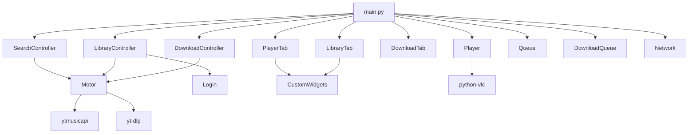

# ReproBabb - Complete Documentation & Project Guide

A minimalist **YouTube Music desktop player** built with Python and Qt6 (PySide6).
Audio plays through VLC via `python-vlc`, downloads go through `yt-dlp`, and YouTube Music data comes from `ytmusicapi`.

> **Unofficial client.** Not affiliated with YouTube or Google.

## Table of Contents

1. [Key Features](#key-features)
2. [Installation & Requirements](#installation--requirements)
3. [User Guide](#user-guide)
4. [System Architecture](#system-architecture)
5. [Project Structure](#project-structure)
6. [Performance Optimizations (Model/View)](#performance-optimizations-modelview)
7. [Data Flow & Concurrency](#data-flow--concurrency)
8. [Troubleshooting](#troubleshooting)

---

## Key Features

* **Audio Streaming**: Instant search and playback directly from YouTube Music.
* **Library Management**: Browse personal playlists and saved albums (via browser session authentication with `browser.json`).
* **Virtualized Playback Queue**:
  * Jump directly between songs by clicking.
  * Native reordering via **Drag & Drop**.
  * Smart **Shuffle** Mode: When shuffle is enabled, the currently playing song automatically pins to the first position (index 0) in the queue.
* **Radio Mode**: Automatically generate queues of similar songs based on any playing track.
* **Download Manager**: Download individual tracks or entire playlists as MP3 files with real-time progress bars and instant cancellation support.
* **Dynamic Visualizer**: Audio frequency wave visualizer whose accent color dynamically adapts to the dominant palette of the current album cover.
* **Keyboard Shortcuts**: Direct playback and volume controls.

---

## Installation & Requirements

### Prerequisites

* **Python 3.10+**
* **VLC Media Player**: The architecture (32-bit vs. 64-bit) of VLC must match your Python interpreter (e.g., 64-bit Python requires 64-bit VLC).
* **ffmpeg**: Must be installed and added to your system's `PATH` (required by `yt-dlp` to extract and convert audio to MP3).

### Installation Steps

```bash
# 1. Clone the repository
git clone https://github.com/Adambabb/ReproBabb.git
cd ReproBabb

# 2. Create and activate a virtual environment
python -m venv .venv
# On Linux/macOS:
source .venv/bin/activate
# On Windows:
.venv\Scripts\activate

# 3. Install dependencies
pip install -r requirements.txt

# 4. Launch the application
python main.py
```

---

## User Guide

1. **Search & Playback**: Enter a song or artist name in the top search bar. Click any result to begin playback and populate the queue.
2. **Context Actions**: Right-click any track to access options for **Play Next**, **Add to playlist**, or **Download**.
3. **Downloads Tab**: Monitor active downloads in real time and cancel tasks whenever needed using the **X** button.

### Authentication for Personal Library

1. Open the **Library** tab and click **Create Browser**.
2. In the web window that opens, sign in to your Google / YouTube Music account.
3. Once the browser completes navigation to `music.youtube.com`, the window closes automatically, and your user playlists will load.

> **Security Note:** Your session is stored locally as `browser.json` inside your system's user application data folder (`AppData`). Never share or commit this file to public repositories.

### Keyboard Shortcuts

| Key | Action |
| --- | --- |
| `Space` | Play / Pause |
| `←` / `→` | Previous track / Next track |
| `↑` / `↓` | Volume Up / Volume Down |

---

## System Architecture

The project follows a modular, decoupled pattern where **`main.py`** acts as a lightweight orchestrator. It delegates business logic to dedicated controllers and handles UI rendering using Qt's **Model/View** architecture.



### Module Breakdown

| Module | Responsibility |
| --- | --- |
| **`main.py`** | Application entry point. Instantiates the window, tabs, and controllers, and connects global signals/slots and timers. |
| **`controllers/SearchController.py`** | Handles background search threads, result version filtering, and similar song radio generation. |
| **`controllers/LibraryController.py`** | Manages user session loading, asynchronous playlist fetching, and playlist track modifications. |
| **`controllers/DownloadController.py`** | Coordinates background single-track and playlist download threads with `DownloadQueue` and `Motor.fetch`. |
| **`Motor.py`** | Pure Python data layer (no Qt dependencies). Direct wrapper for `ytmusicapi` and `yt_dlp`. |
| **`Player.py`** | Wrapper around `python-vlc`. Manages playback states, track length, and playback position. |
| **`Queue.py`** | Queue business logic (`SongQueue`) and virtualized data model (`QueueModel` inheriting from `QAbstractListModel`). |
| **`DownloadQueue.py`** | Thread-safe state holder (`threading.Lock`) for active downloads, progress percentages, and cancellation flags. |
| **`PlayerTab.py` / `LibraryTab.py` / `DownloadTab.py`** | Views and UI components for the three main tabs. |
| **`Network.py`** | Asynchronous thumbnail downloader using `ThreadPoolExecutor` and internal caching. |
| **`CustomWidgets.py`** | Lightweight pixel-level delegate (`SongItemDelegate`) and custom widgets (`TimeDesign`, `VolumeDesign`). |
| **`Login.py`** | Web engine dialog (`QWebEngineView`) used to capture the Google session cookie. |
| **`Utils.py`** | Utility function `resource_path()` for resolving resource paths in both source code and PyInstaller executable builds. |
| **`Styles/styles.qss`** | Global QSS stylesheet for application styling. |

---

## Project Structure

```
ReproBabb/
├── main.py
├── controllers/
│   ├── DownloadController.py
│   ├── LibraryController.py
│   └── SearchController.py
├── PlayerTab.py
├── LibraryTab.py
├── DownloadTab.py
├── Player.py
├── Queue.py
├── DownloadQueue.py
├── Motor.py
├── Network.py
├── CustomWidgets.py
├── Login.py
├── Utils.py
├── Styles/
│   └── styles.qss
├── Assets/               # Icons and default album cover image
├── requirements.txt
└── LICENSE
```

---

## Performance Optimizations (Model/View)

To eliminate UI freezes and reduce CPU/memory overhead when loading large song collections (such as playlists with hundreds of tracks), the application utilizes a virtualized architecture:

1. **`QListView` + `QAbstractListModel`**:
   * `QueueModel` (`Queue.py`) and `PlaylistSongsModel` (`LibraryTab.py`) manage internal data structures.
   * Row insertion, removal, and reordering are communicated using granular Qt methods (`beginInsertRows`, `beginRemoveRows`, `beginMoveRows`), achieving **0 ms** UI latency.

2. **Pixel-Level Render Delegate (`SongItemDelegate` in `CustomWidgets.py`)**:
   * Instead of instantiating hundreds of heavy `QWidget` rows (`QFrame`, `QLabel`, etc.), the delegate renders only visible rows directly on screen using `QPainter`.
   * Uses `QFontMetrics.elidedText` to dynamically truncate long titles or artist names with `"..."` when exceeding visible bounds.

3. **Native Drag & Drop**:
   * `QueueModel` implements native drag & drop reordering using a custom MIME type (`application/x-reprobabb-song-row`). Dragging rows alters the internal memory list without reconstructing UI widgets.

4. **Internal Thumbnail Caching**:
   * Models store a `_thumbnail_cache` mapping image icons to track IDs, ensuring cover art remains immediately visible when reordering or moving items without triggering duplicate HTTP requests.

---

## Data Flow & Concurrency

* **Background Threads (`threading.Thread` & `ThreadPoolExecutor`)**: All network operations (searching, link extraction with `yt-dlp`, or downloading) execute outside the main GUI thread. Results pass back to the UI thread strictly via Qt signals (`PySide6.QtCore.Signal`).
* **Timer Polling**: Rapidly changing UI elements (such as playback timeline sliders or download progress bars) poll state data via `QTimer` instances rather than emitting hundreds of signals per second, keeping event queues responsive.
* **Download Cancellation**: `yt-dlp` download jobs listen to the `is_cancelled_fn` progress hook. If marked as cancelled in `DownloadQueue`, the hook raises `DownloadCancelled`, aborting the download mid-stream immediately.

---

## Troubleshooting

* **Playback fails to start (`python-vlc` cannot find VLC)**:
  Ensure your VLC installation matches your Python environment bitness (e.g., both 64-bit).

* **Downloads fail during MP3 conversion**:
  Verify that `ffmpeg` is installed properly and accessible in your command line (`ffmpeg -version`).

* **Search or Library requests fail unexpectedly**:
  YouTube frequently updates its internal APIs. Update the core dependencies by running:
  ```bash
  pip install -U yt-dlp ytmusicapi
  ```

* **Expired library session error**:
  Open the **Library** tab, click **Create Browser**, and sign in again to regenerate your local `browser.json` credentials.

---

## License

This project is licensed under the **MIT License**. See the `LICENSE` file for details.